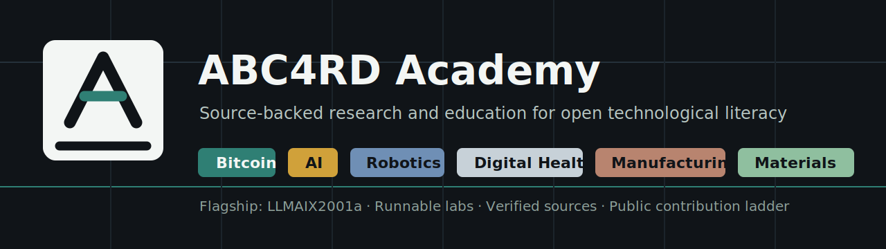

# ABC4RD Academy

**ABC4RD Academy** is a source-backed research and education center for
Bitcoin, AI, open compute, robotics, digital health, digital manufacturing,
nanomaterials, and trustworthy public infrastructure.

The academy traces its public origin to a 2017 university blockchain education
story covered by [Bitcoin Magazine](https://bitcoinmagazine.com/culture/russian-university-wants-take-blockchain-research-global)
and syndicated by [Nasdaq](https://www.nasdaq.com/articles/the-russian-university-that-wants-to-take-blockchain-research-global-2017-02-22).
The current relaunch is international, open, practical, and careful about
claims.

## Start Here

| I want to | Go to | First useful action |
| --- | --- | --- |
| Understand the academy | [`ABC4RD`](https://github.com/ABC4RDacademy/ABC4RD) | Read the roadmap and research tracks |
| Build the flagship product | [`LLMAIX2001a`](https://github.com/ABC4RDacademy/LLMAIX2001a) | Run Module 01 Bigram Language Model |
| Verify public claims | [`abc4rd-research`](https://github.com/ABC4RDacademy/abc4rd-research) | Review source maps and citation packs |
| Join the community | [`abc4rd-community`](https://github.com/ABC4RDacademy/abc4rd-community) | Read onboarding and choose a role |

## Flagship

[`LLMAIX2001a`](https://github.com/ABC4RDacademy/LLMAIX2001a) is the first
flagship course and product path: a practical route from language-model
foundations to a Storyteller AI prototype.

Current public artifact:

- runnable Module 01 Bigram Language Model lab;
- toy dataset and deterministic expected output;
- unit tests, learner exercises, and glossary;
- next modules for micrograd, n-grams, attention, transformers, deployment,
  agents, AGI/ASI literacy, and blockchain-backed trust.

## Research Tracks

| Track | Focus |
| --- | --- |
| Bitcoin and open finance | Protocol literacy, cryptography, Lightning, custody, public evidence |
| AI and open compute | Language models, agents, evaluations, open infrastructure |
| Robotics and sensors | ROS, Gazebo, MoveIt, IoT, telemetry integrity, simulation |
| Digital health standards | FHIR, SMART Guidelines, OpenMRS, privacy, ethics |
| Digital manufacturing | Digital thread, traceability limits, standards, open tooling |
| Nanomaterials | Simulation, responsible development, open scientific infrastructure |

## Contribution Ladder

1. Read and summarize one source.
2. Verify source status and license/access notes.
3. Add a glossary term.
4. Improve documentation.
5. Create a small exercise.
6. Open a precise external issue.
7. Submit a small external pull request.
8. Review another learner's work.
9. Lead a small research track.

## Public Repositories

| Repository | Purpose |
| --- | --- |
| [`ABC4RD`](https://github.com/ABC4RDacademy/ABC4RD) | Main hub, website/docs, roadmap, publishing policy |
| [`LLMAIX2001a`](https://github.com/ABC4RDacademy/LLMAIX2001a) | Flagship AI course and Storyteller AI prototype path |
| [`abc4rd-research`](https://github.com/ABC4RDacademy/abc4rd-research) | Evidence library, source map, citation pack, essays |
| [`abc4rd-community`](https://github.com/ABC4RDacademy/abc4rd-community) | Charter, onboarding, roles, community operations |
| [`open-compute-curriculum`](https://github.com/ABC4RDacademy/open-compute-curriculum) | Open compute and scientific computing literacy |
| [`sensor-networks-curriculum`](https://github.com/ABC4RDacademy/sensor-networks-curriculum) | Sensors, IoT, LPWAN, and networks |
| [`robotics-systems-curriculum`](https://github.com/ABC4RDacademy/robotics-systems-curriculum) | ROS, Gazebo, MoveIt, simulation, and safety framing |
| [`digital-health-standards-curriculum`](https://github.com/ABC4RDacademy/digital-health-standards-curriculum) | FHIR, WHO SMART Guidelines, and open health systems |
| [`digital-manufacturing-curriculum`](https://github.com/ABC4RDacademy/digital-manufacturing-curriculum) | Digital thread, additive manufacturing, and traceability |
| [`nanomaterials-research-curriculum`](https://github.com/ABC4RDacademy/nanomaterials-research-curriculum) | Nanomaterials, simulation, and responsible research |

## Claim Discipline

ABC4RD Academy does not claim affiliation, endorsement, partnership, clinical
deployment, financial advice, safety-critical deployment, or AGI/ASI capability
unless there is public evidence or explicit written approval. Unverified items
are marked `requires verification`.

## Channels

- Website: [abc4rd.org](http://abc4rd.org/)
- Discussions: [ABC4RD Discussions](https://github.com/ABC4RDacademy/ABC4RD/discussions)
- Research center upgrade: [discussion #15](https://github.com/ABC4RDacademy/ABC4RD/discussions/15)
- X: [@academy_abc4rd](https://x.com/academy_abc4rd)
- Telegram: [channel](https://www.t.me/abc4rdchannel), [chat](https://www.t.me/abc4rdchat), [bot](https://www.t.me/abc4rd_bot)
- Discord: [ABC4RD invite](https://discord.com/invite/3AgRv6wKPQ)
